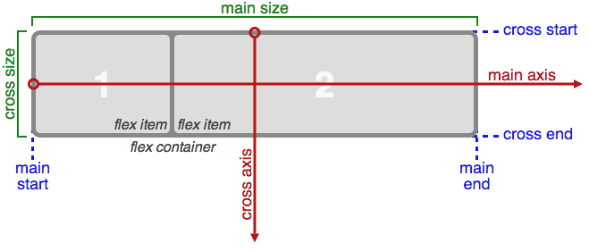
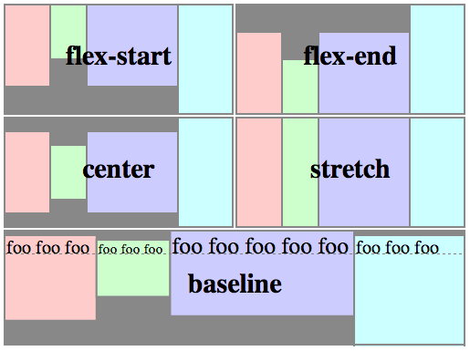
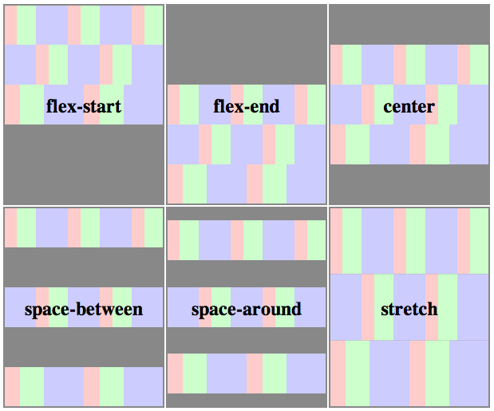

# Полное руководство по Flexbox

Модуль *Flexbox-лейаута* (flexible box — «гибкий блок», на данный момент W3C Candidate Recommendation) ставит задачу предложить более эффективный способ вёрстки, выравнивания и распределения свободного места между элементами в контейнере, даже когда их размер неизвестен и/или динамический (отсюда слово «гибкий»).

Главная задумка flex-вёрстки в наделении контейнера способностью изменять ширину/высоту (и порядок) своих элементов для наилучшего заполнения пространства (в большинстве случаев — для поддержки всех видов дисплеев и размеров экранов). Flex-контейнер растягивает элементы для заполнения свободного места или сжимает их, чтобы предотвратить выход за границы.

Самое важное, flexbox-лейаут не зависит от направления в отличие от обычных лейаутов (блоки, располагащиеся вертикально, и инлайн-элементы, располагающиеся горизонтально). В то время, как обычный лейаут отлично подходит для веб-страниц, ему не хватает гибкости (никакого каламбура) для поддержки больших или сложных приложений (особенно когда дело доходит до смены ориентации экрана, изменения размера, растягивания, сжатия и т.п.).

**Замечание**: Flexbox-лейаут лучше всего подходит для составных частей приложения и мелкомасштабных лейаутов, в тов ремя как [Grid][1]-лейаут больше используется для лейаутов большого масштаба.

## Основы

Т.к. flexbox — это целый модуль, а не просто единичное свойство, он объединяет в себе множество свойств. Некоторые из них должны применяться к контейнеру (родительскому элементу, так называемому *flex-контейнеру*), в то время как другие свойства применяются к дочерним элементам, или *flex-элементам*.

Если обычный лейаут основывается на направлениях потоков блочных и инлайн-элементов, то flex-лейаут основывается на «направлениях flex-потока». Ознакомьтесь с этой схемой из специкицаии, разъясняющей основную идею flex-лейаутов.

В основном элементы будут распределяться либо вдоль *главной оси* (от *main-start* до *main-end*), либо вдоль *поперечной оси* (от *cross-start* до *cross-end*).

* **main-axis** - главная ось, вдоль которой располагаются flex-элементы. Обратите внимание, она необязательно должна быть горизонтальной, всё зависит от свойства `justify-content` (см. ниже).
* **main-start** | **main-end** - flex-элементы размещаются в контейнере от позиции main-start до позиции main-end.
* **main size** - ширина или высота flex-элемента в зависимости от выбранной основной величины. Основная величина может быть либо шириной, либо высотой элемента.
* **cross axis** - Поперечная ось, перпендикулярная к главной. Её направление зависит о тнаправления главной оси.
* **cross-start** | **cross-end** - Flex lines are filled with items and placed into the container starting on the cross-start side of the flex container and going toward the cross-end side.
* **cross size** - The width or height of a flex item, whichever is in the cross dimension, is the item's cross size. The cross size property is whichever of ‘width’ or ‘height’ that is in the cross dimension.

## Properties

#### `display: flex | inline-flex;` 

Applies to: parent flex container element

This defines a flex container; inline or block depending on the given value. Thus, it enables a flex context for all its direct children.

    display: other values | flex | inline-flex;

  Please note that:
  * CSS columns have no effect on a flex container
  * `float`, `clear` and `vertical-align` have no effect on a flex item

#### `flex-direction` 

Applies to: parent flex container element

This establishes the main-axis, thus defining the direction flex items are placed in the flex container.

    flex-direction: row | row-reverse | column | column-reverse

* `row` (default): left to right in `ltr`; right to left in `rtl`
* `row-reverse`: right to left in `ltr`; left to right in `rtl`
* `column`: same as `row` but top to bottom
* `column-reverse`: same as `row-reverse` but top to bottom

#### `flex-wrap`

Applies to: parent flex container element

This defines whether the flex container is single-line or multi-line, and the direction of the cross-axis, which determines the direction new lines are stacked in.

    flex-wrap: nowrap | wrap | wrap-reverse

* `nowrap` (default): single-line / left to right in `ltr`; right to left in `rtl`
* `wrap`: multi-line / left to right in `ltr`; right to left in `rtl`
* `wrap-reverse`: multi-line / right to left in `ltr`; left to right in `rtl`

#### `flex-flow`

Applies to: parent flex container element

This is a shorthand `flex-direction` and `flex-wrap` properties, which together define the flex container's main and cross axes. Default is `row nowrap`;

    flex-flow: <'flex-direction'> || <'flex-wrap'>

#### `justify-content`

Applies to: parent flex container element

This defines the alignment along the main axis. It helps distribute extra free space leftover when either all the flex items on a line are inflexible, or are flexible but have reached their maximum size. It also exerts some control over the alignment of items when they overflow the line.

    justify-content: flex-start | flex-end | center | space-between | space-around

* `flex-start` (default): items are packed toward the start line
* `flex-end`: items are packed toward to end line
* `center`: items are centered along the line
* `space-between`: items are evenly distributed in the line; first item is on the start line, last item on the end line
* `space-around`: items are evenly distributed in the line with equal space around them

#### `align-items`

Applies to: parent flex container element

This defines the default behaviour for how flex items are laid out along the cross axis on the current line. Think of it as the `justify-content` version for the cross-axis (perpendicular to the main-axis).

    align-items: flex-start | flex-end | center | baseline | stretch

* `flex-start`: cross-start margin edge of the items is placed on the cross-start line 
* `flex-end`: cross-end margin edge of the items is placed on the cross-end line 
* `center`: items are centered in the cross-axis 
* `baseline`: items are aligned such as their baselines align 
* `stretch` (default): stretch to fill the container (still respect min-width/max-width)

#### `align-content`

Applies to: parent flex container element

This aligns a flex container's lines within when there is extra space in the cross-axis, similar to how `justify-content` aligns individual items within the main-axis.

**Note**: this property has no effect when the flexbox has only a single line.

    align-content: flex-start | flex-end | center | space-between | space-around | stretch

* `flex-start`: lines packed to the start of the container 
* `flex-end`: lines packed to the end of the container 
* `center`: lines packed to the center of the container 
* `space-between`: lines evenly distributed; the first line is at the start of the container while the last one is at the end 
* `space-around`: lines evenly distributed with equal space between them 
* `stretch` (default): lines stretch to take up the remaining space 

#### `order` 

Applies to: child element / flex item

By default, flex items are layed out in the source order. However, the `order` property controls the order in which they appear in their container.

    order: <integer>

#### `flex-grow` 

Applies to: child element / flex item

This defines the ability for a flex item to grow if necessary. It accepts a unitless value that serves as a proportion. It dictates what amount of the available space inside the flex container the item should take up.

If all items have `flex-grow` set to 1, every child will set to an equal size inside the container. If you were to give one of the children a value of 2, that child would take up twice as much space as the others.

    flex-grow: <number> (default 0)

Negative numbers are invalid.

#### `flex-shrink`

Applies to: child element / flex item

This defines the ability for a flex item to shrink if necessary.

    flex-shrink: <number> (default 1)

Negative numbers are invalid.

#### `flex-basis`

Applies to: child element / flex item

This defines the default size of an element before the remaining space is distributed.

    flex-basis: <length> | auto (default auto)

#### `flex` 

Applies to: child element / flex item

This is the shorthand for `flex-grow`, `flex-shrink` and `flex-basis`. The second and third parameters (`flex-shrink`, `flex-basis`) are optional. Default is `0 1 auto`.

    flex: none | [ <'flex-grow'> <'flex-shrink'>? || <'flex-basis'> ]

#### `align-self`

Applies to: child element / flex item

This allows the default alignment or the one specified by `align-items` to be overridden for individual flex items.

Please see the `align-items` explanation to understand the available values.

    align-self: auto | flex-start | flex-end | center | baseline | stretch

## Examples

Let's start with a very very simple example, solving an almost daily problem: perfect centering. It couldn't be any simpler if you use flexbox.

    .parent {
      display: flex;
      height: 300px; /* Or whatever */
    }

    .child {
      width: 100px;  /* Or whatever */
      height: 100px; /* Or whatever */
      margin: auto;  /* Magic! */
    }

This relies on the fact a margin set to `auto` in a flex container absorb extra space. So setting a vertical margin of `auto` will make the item perfectly centered in both axis.

Now let's use some more properties. Consider a list of 6 items, all with a fixed dimensions in a matter of aesthetics but they could be auto-sized. We want them to be evenly and nicely distributed on the horizontal axis so that when we resize the browser, everything is fine (without media queries!).

    .flex-container {
      /* We first create a flex layout context */
      display: flex;
      
      /* Then we define the flow direction and if we allow the items to wrap 
       * Remember this is the same as:
       * flex-direction: row;
       * flex-wrap: wrap;
       */
      flex-flow: row wrap;
      
      /* Then we define how is distributed the remaining space */
      justify-content: space-around;
    }

Done. Everything else is just some styling concern. Below is a pen featuring this example. Be sure to go to CodePen and try resizing your windows to see what happen.

<pre class="codepen" data-height="400" data-type="result" data-href="LklCv" data-user="HugoGiraudel" data-safe="false"><code></code><a href="http://codepen.io/HugoGiraudel/pen/LklCv">Check out this Pen!</a></pre>

Let's try something else. Imagine we have a right-aligned navigation on the very top of our website, but we want it to be centered on medium-sized screens and single-columned on small devices. Easy enough.

    /* Large */
    .navigation {
      display: flex;
      flex-flow: row wrap;
      /* This aligns items to the end line on main-axis */
      justify-content: flex-end;
    }

    /* Medium screens */
    @media all and (max-width: 800px) {
      .navigation {
        /* When on medium sized screens, we center it by evenly distributing empty space around items */
        justify-content: space-around;
      }
    }

    /* Small screens */
    @media all and (max-width: 500px) {
      .navigation {
        /* On small screens, we are no longer using row direction but column */
        flex-direction: column;
      }
    }

<pre class="codepen" data-height="100" data-type="result" data-href="pkwqH" data-user="HugoGiraudel" data-safe="false"><code></code><a href="http://codepen.io/HugoGiraudel/pen/pkwqH">Check out this Pen!</a></pre>

Let's try something even better by playing with flex items flexibility! What about a mobile-first 3-columns layout with full-width header and footer. And independent from source order.

    .wrapper {
      display: flex;
      flex-flow: row wrap;
    }

    /* We tell all items to be 100% width */
    .header, .main, .nav, .aside, .footer {
      flex: 1 100%;
    }

    /* We rely on source order for mobile-first approach
     * in this case:
     * 1. header
     * 2. nav
     * 3. main
     * 4. aside
     * 5. footer
     */

    /* Medium screens */
    @media all and (min-width: 600px) {
      /* We tell both sidebars to share a row */
      .aside { flex: 1 auto; }
    }

    /* Large screens */
    @media all and (min-width: 800px) {
      /* We invert order of first sidebar and main
       * And tell the main element to take twice as much width as the other two sidebars 
       */
      .main { flex: 2 0px; }
      
      .aside-1 { order: 1; }
      .main    { order: 2; }
      .aside-2 { order: 3; }
      .footer  { order: 4; }
    }

<pre class="codepen" data-height="300" data-type="result" data-href="qIAwr" data-user="HugoGiraudel" data-safe="false"><code></code><a href="http://codepen.io/HugoGiraudel/pen/qIAwr">Check out this Pen!</a></pre>

## Related Properties
* [Grid][1]

## Other Resources
* [Flexbox in the CSS specifications][2]
* [Flexbox at MDN][3]
* [Flexbox at Opera][4]
* [Diving into Flexbox by Bocoup][5]
* [Mixing syntaxes for best browser support on CSS-Tricks][6]
* [Flexbox by Raphael Goetter (FR)][7]
* [Flexplorer by Bennett Feely][8]

## Browser Support
* (modern) means the recent syntax from the specification (e.g. `display: flex;`)
* (hybrid) means an odd unofficial syntax from 2011 (e.g. `display: flexbox;`)
* (old) means the old syntax from 2009 (e.g. `display: box;`)

<table>
  <thead>
    <tr>
      <th>Chrome</th>
      <th>Safari</th>
      <th>Firefox</th>
      <th>Opera</th>
      <th>IE</th>
      <th>Android</th>
      <th>iOS</th>
    </tr>
  </thead>
  <tbody>
    <tr>
      <td>21+ (modern) 20- (old)</td>
      <td>3.1+ (old)</td>
      <td>2-21 (old) 22+ (new)</td>
      <td>12.1+ (modern)</td>
      <td>10+ (hybrid)</td>
      <td>2.1+ (old)</td>
      <td>3.2+ (old)</td>
    </tr>
  </tbody>
</table>

Blackberry browser 10+ supports the new syntax.

For more informations about how to mix syntaxes in order to get the best browser support, please refer to [this article (CSS-Tricks)][9] or [this article (DevOpera)][10].

A Sass @mixin to help ease the pain:

    @mixin flexbox() {
      display: -webkit-box;
      display: -moz-box;
      display: -ms-flexbox;
      display: -webkit-flex;
      display: flex;
    }

    @mixin flex($values) {
      -webkit-box-flex: $values;
      -moz-box-flex:  $values;
      -webkit-flex:  $values;
      -ms-flex:  $values;
      flex:  $values;
    }

    @mixin order($val) {
      -webkit-box-ordinal-group: $val;  
      -moz-box-ordinal-group: $val;     
      -ms-flex-order: $val;     
      -webkit-order: $val;  
      order: $val;
    }

    .wrapper {
      @include flexbox();
    }

    .item {
      @include flex(1 200px);
      @include order(2);
    }

[1]: http://css-tricks.com/almanac/properties/g/grid/
[2]: http://www.w3.org/TR/css3-flexbox/
[3]: https://developer.mozilla.org/en-US/docs/CSS/Tutorials/Using_CSS_flexible_boxes
[4]: http://dev.opera.com/articles/view/flexbox-basics/
[5]: http://weblog.bocoup.com/dive-into-flexbox/
[6]: http://css-tricks.com/using-flexbox/
[7]: http://www.alsacreations.com/tuto/lire/1493-css3-flexbox-layout-module.html
[8]: http://bennettfeely.com/flexplorer/
[9]: http://css-tricks.com/using-flexbox/
[10]: http://dev.opera.com/articles/view/advanced-cross-browser-flexbox/#fallbacks